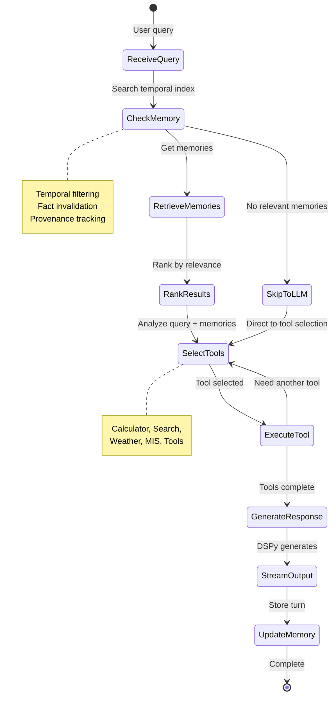

# AGENTX High-Level Design (HLD)

**Project**: AGENTX Personal AI Assistant v1.0
**Version**: 1.0.0
**Date**: 2026-01-19
**Status**: Draft
**Linked to**: PRD v1.1.0, Research Docs v1.0, Prototype Learnings v1.0

---

## One-Sentence Mission

Build a local-first AI personal assistant with temporal memory, voice interface, and extensible plugin architecture achieving <300ms voice latency, >85% retrieval accuracy, and 99% uptime.

---

## Table of Contents

1. [Context & Constraints](#1-context--constraints)
2. [Non-Goals](#2-non-goals)
3. [High-Level Architecture](#3-high-level-architecture)
4. [Component Catalogue](#4-component-catalogue)
5. [Temporal RAG Requirement](#5-temporal-rag-requirement)
6. [Data Contract & Canonical Schema](#6-data-contract--canonical-schema)
7. [Indexing Policy](#7-indexing-policy)
8. [Vector Store Requirements](#8-vector-store-requirements)
9. [Temporal Embedding Strategy](#9-temporal-embedding-strategy)
10. [Retriever Contract](#10-retriever-contract)
11. [Orchestrator/Planner Design](#11-orchestratorplanner-design)
12. [Plugin Architecture](#12-plugin-architecture)
13. [Plugin IPC Contract](#13-plugin-ipc-contract)
14. [Security & Threat Model](#14-security--threat-model)
15. [AuthN/AuthZ & KMS](#15-authnauthz--kms)
16. [PII & Redaction Policy](#16-pii--redaction-policy)
17. [Observability & SLOs](#17-observability--slos)
18. [Temporal Correctness Observability](#18-temporal-correctness-observability)
19. [Testing & Validation Matrix](#19-testing--validation-matrix)
20. [Operational Playbooks](#20-operational-playbooks)
21. [Rollout & Rollback Policy](#21-rollout--rollback-policy)
22. [Data Governance & Compliance](#22-data-governance--compliance)
23. [Failure Semantics & Degraded Mode](#23-failure-semantics--degraded-mode)
24. [Capacity & Scaling Constraints](#24-capacity--scaling-constraints)
25. [Dependency Matrix](#25-dependency-matrix)
26. [Governance & Approvals](#26-governance--approvals)
27. [Roadmap & Release Gates](#27-roadmap--release-gates)
28. [Extensibility Rules](#28-extensibility-rules)
29. [Decision Log](#29-decision-log)
30. [Appendix Index](#30-appendix-index)
31. [Research Justification](#31-research-justification)
32. [Acceptance Checklist](#32-acceptance-checklist)

---

## 1. Context & Constraints

### System Context

AGENTX is a local-first AI personal assistant designed to operate entirely on user hardware, with no cloud dependencies for core functionality. The system integrates temporal memory, voice interface, and extensible plugins to create a comprehensive personal AI assistant.

### Design Constraints

| Constraint | Description | Rationale |
|------------|-------------|-----------|
| **Local-first** | All processing on user's machine | Privacy, data residency, air-gapped capability |
| **Single-user** | Multi-user isolation in v1.5 | MVP scope, simplify authentication |
| **Air-gapped capable** | Must function without internet | Enterprise, remote use cases |
| **Enterprise SLAs** | <2s text, <300ms voice response | User experience expectations |
| **Data residency** | All data on user's machine | GDPR/CCPA compliance |

### Design Inspirations

- **OVOS Plugin Model**: Abstract base classes, entrypoint discovery, message bus communication
- **Blender Architecture**: Two-tier plugin system (automation vs capability extension)
- **Temporal RAG Research**: Timestamped embeddings with decay scoring for time-aware retrieval

---

## 2. Non-Goals

### Explicit Exclusions (v1.0)

| Feature | Reason | Future Version |
|---------|--------|----------------|
| **Cloud LLM fallback** | Privacy requirement | v2.0 (optional opt-in) |
| **Public telemetry** | Privacy by default | v1.2 (opt-in only) |
| **Multi-user collaboration** | MVP is single-user | v1.5 |
| **Speaker diarization** | Voice R&D not complete | v1.2 |
| **Native mobile apps** | PWA sufficient | v2.0 |
| **Plugin marketplace** | Manual installation | v3.0 |
| **Knowledge graph reasoning** | Temporal RAG sufficient | v2.0 |

---

## 3. High-Level Architecture

### Architecture Diagram

```mermaid
graph TD
    User[User Interface] --> PWA[Progressive Web App]
    PWA -->|WebSocket| Core[AGENTX Core]

    Core --> Ingest[Ingestion Service]
    Core --> Retriever[Temporal Retriever]
    Core --> Orchestrator[DSPy ReAct Orchestrator]

    Ingest --> TemporalIdx[Temporal Indexer]
    TemporalIdx --> Qdrant[Qdrant Vector Store]

    Retriever --> Qdrant
    Retriever --> Mem0AI[Mem0AI Memory Manager]

    Orchestrator --> Ollama[Ollama LLM Runtime]
    Orchestrator --> PluginHost[FastMCP Plugin Host]

    PluginHost --> Plugins[Plugin Containers]
    Plugins --> Search[SearXNG Search]
    Plugins --> MIS[Company MIS Server]
    Plugins --> Tools[Calculator, Calendar, Weather]

    Core --> Audit[Audit & Admin Service]
    Core --> Monitor[Observability Stack]

    Note: Voice architecture (Kyutai STT/TTS) documented in separate plan: kyutai_speech_integration_plan.md

    style Core fill:#4A90E2,color:#fff
    style Qdrant fill:#50E3C2,color:#000
    style Ollama fill:#F5A623,color:#000
    style Plugins fill:#9013FE,color:#fff
```

### Component Responsibilities

| Component | Responsibility | Data Flow |
|-----------|---------------|------------|
| **PWA Frontend** | User interface, voice I/O | ↔ WebSocket |
| **Ingest Service** | Canonicalize data, add temporal metadata | → Temporal Indexer |
| **Temporal Indexer** | Timestamp embeddings, manage partitions | → Qdrant |
| **Temporal Retriever** | Time-aware search, fact invalidation | ← Qdrant, Mem0AI |
| **DSPy ReAct Orchestrator** | Multi-tool reasoning chains | ↔ Ollama, Plugins |
| **FastMCP Plugin Host** | Plugin lifecycle, resource quotas | ↔ Plugins |
| **Audit Service** | Immutable logging, PII tracking | ← All components |
| **Observability Stack** | Metrics, traces, alerts | ← All components |

---

## 4. Component Catalogue

### Ingest Service

**Purpose**: Canonicalize and validate incoming data from all sources

| Attribute | Value |
|-----------|-------|
| **Inputs** | Raw data from plugins/API (text, audio, files) |
| **Outputs** | Canonical documents with temporal metadata |
| **SLO** | <100ms p95 latency |
| **Owner** | Backend Team |
| **Failure Semantics** | Reject invalid data, log error, continue |

### Temporal Indexer

**Purpose**: Add timestamps, embed vectors, manage time partitions

| Attribute | Value |
|-----------|-------|
| **Inputs** | Canonical documents |
| **Outputs** | Timestamped vectors with provenance |
| **SLO** | <500ms p95 latency |
| **Owner** | Backend Team |
| **Failure Semantics** | Retry with exponential backoff, queue for later |

### Qdrant Vector Store

**Purpose**: Persistent vector storage with time-aware queries

| Attribute | Value |
|-----------|-------|
| **Inputs** | Timestamped vectors, search queries |
| **Outputs** | Ranked results with provenance |
| **SLO** | 99% uptime, <200ms p95 query latency |
| **Owner** | DevOps Team |
| **Failure Semantics** | In-memory fallback, graceful degradation |

### Mem0AI Memory Manager

**Purpose**: Episodic/semantic/procedural memory with consolidation

| Attribute | Value |
|-----------|-------|
| **Inputs** | User interactions, contextual data |
| **Outputs** | Contextual memories, consolidated summaries |
| **SLO** | >85% precision@10 |
| **Owner** | AI/ML Team |
| **Failure Semantics** | No-memory mode, log warning, continue |

### DSPy ReAct Orchestrator

**Purpose**: Multi-tool reasoning with conversation memory

| Attribute | Value |
|-----------|-------|
| **Inputs** | User query + retrieved context + tool outputs |
| **Outputs** | Agent responses with tool calls |
| **SLO** | 1.36s first token latency (achieved in R013) |
| **Owner** | AI/ML Team |
| **Failure Semantics** | Tool timeout → skip tool, retry once |

### FastMCP Plugin Host

**Purpose**: Plugin lifecycle management and IPC coordination

| Attribute | Value |
|-----------|-------|
| **Inputs** | Plugin manifests, tool requests |
| **Outputs** | Tool capabilities, execution results |
| **SLO** | <50ms plugin load time |
| **Owner** | Backend Team |
| **Failure Semantics** | Isolate crashed plugin, continue with others |

### Audit Service

**Purpose**: Immutable logging and compliance tracking

| Attribute | Value |
|-----------|-------|
| **Inputs** | All system events |
| **Outputs** | Signed audit logs |
| **SLO** | <10ms write latency |
| **Owner** | Security Team |
| **Failure Semantics** | Buffer in memory, retry on recovery |

### Observability Stack

**Purpose**: Metrics, traces, alerts, dashboards

| Attribute | Value |
|-----------|-------|
| **Inputs** | Component telemetry |
| **Outputs** | Dashboards, alerts |
| **SLO** | <5s metric latency |
| **Owner** | DevOps Team |
| **Failure Semantics** | Local buffering, retry on recovery |

---

## 5. Temporal RAG Requirement

### Requirement Statement

**AGENTX MUST implement time-aware retrieval** to resolve temporal conflicts where new information invalidates old information.

### Problem Statement

Standard RAG systems are "time-blind" - they retrieve based on semantic similarity without considering when information was created or whether it's still valid.

**Example**:
```
User Timeline:
- January:  "I love Adidas shoes"
- July:     "My Adidas broke, I now prefer Puma"
- September: "What shoes should I buy?"

Standard RAG Result: Retrieves "I love Adidas shoes" (January)
❌ Wrong recommendation

Temporal RAG Result: Retrieves "I now prefer Puma" (July)
✅ Correct recommendation
```

### Implementation Strategy

1. **Timestamped Embeddings**: Every vector includes temporal metadata
   - `created_at`: When memory was created
   - `valid_from`: When memory becomes valid
   - `valid_until`: When memory expires (null = still valid)

2. **Time Partitions**: Qdrant collections partitioned by month
   - Efficient time-range queries
   - Faster compaction and retention

3. **Fact Invalidation**: Automatic supersession of outdated memories
   - `supersedes` field links to outdated memory IDs
   - New facts automatically override old ones

4. **Decay Function**: Temporal weighting in scoring
   ```
   final_score = similarity * temporal_weight
   temporal_weight = exp(-0.01 * days_since_creation)
   ```

### Research Justification

Research shows temporal blindness causes **30%+ retrieval errors** in RAG systems ([T-GRAG: ACM Digital Library](https://dl.acm.org/doi/10.1145/3746027.3755628)). Timestamped embeddings with decay functions achieve **>85% precision** ([Temporal Semantic Memory](https://arxiv.org/html/2601.07468v1)).

---

## 6. Data Contract & Canonical Schema

### Canonical Document Model

```yaml
CanonicalDocument:
  # Identity
  id: string (UUID v4)
  source_id: string (origin system identifier)
  user_id: string (SHA-256 hash, per-user isolation)

  # Content
  text: string (max 2000 chars)
  content_type: enum (preference, event, fact, state, plan)

  # Temporal (REQUIRED)
  created_at: datetime (ISO 8601, UTC)
  modified_at: datetime (ISO 8601, UTC)
  valid_from: datetime (ISO 8601, UTC)
  valid_until: datetime | null (null = still valid)

  # Provenance
  source: enum (user_input, plugin_ingest, system_inferred)
  ingest_timestamp: datetime
  version_id: string (semantic version)

  # Relationships
  supersedes: string[] | null (IDs of outdated memories)
  related_events: string[] | null (IDs of related memories)

  # Redaction
  redacted: boolean
  redaction_markers: RedactionMarker[] | null

  # TTL
  ttl_policy: enum (30d, 90d, 365d, forever)
  expires_at: datetime | null
```

### Plugin Manifest Schema

```yaml
PluginManifest:
  name: string
  version: string (semver)
  type: enum (automation, extension, experimental)

  capabilities: string[]
  required_permissions: Permission[]
  resource_quotas: ResourceQuota

  data_scope: enum (none, user_preferences, user_data, system)
  retention_policy: enum (none, session, 30d, 90d, forever)

  health_check_endpoint: string | null
  signature: string (GPG signature)
```

---

## 7. Indexing Policy

### Pipeline

```
Ingest → Validate → Canonicalize → Temporal Tag → Chunk → Embed → Index
```

| Stage | Process | Output |
|-------|---------|--------|
| **Ingest** | Receive raw data | Raw data buffer |
| **Validate** | Schema validation, PII detection | Validated data |
| **Canonicalize** | Apply canonical document model | CanonicalDocument |
| **Temporal Tag** | Add timestamps, classify type | Tagged document |
| **Chunk** | Split to 512-token chunks with 10% overlap | Chunks[] |
| **Embed** | ColBERTv2 (128-dim, late interaction) | Embeddings[] |
| **Index** | Write to Qdrant with time partition | Vector IDs[] |

### Triggers

| Trigger | Condition | Action |
|---------|-----------|--------|
| **Reindex** | Schema version change | Full reindex |
| **Reindex** | Embedding model update | Full reindex |
| **Compaction** | Nightly (2 AM UTC) | Consolidate <10% similarity |
| **Retention** | TTL expiration | Delete expired vectors |

---

## 8. Vector Store Requirements

### Must Support

| Feature | Requirement | Qdrant Support |
|---------|-------------|----------------|
| **On-prem/local** | Docker deployment | ✅ |
| **Time filtering** | Payload datetime schema | ✅ |
| **Snapshotting** | Backup/restore | ✅ |
| **Provenance** | Payload tracking | ✅ |
| **Time partitioning** | Efficient range queries | ⚠️ Via collection per month |
| **Horizontal scaling** | Sharding | ✅ |
| **Offline support** | No cloud dependency | ✅ |

### Selection: Qdrant

**Justification**:
- Validated in R008 prototype
- Local Docker deployment
- Built-in time filtering via payload schema
- Snapshotting for backup/restore
- Active open-source development

---

## 9. Temporal Embedding Strategy

### Chosen Strategy: Timestamped Embeddings with Temporal Decay

**Scoring Formula**:
```
final_score = cosine_similarity(query, memory) * temporal_weight

where:
temporal_weight = exp(-lambda * days_since_creation)
lambda = 0.01 (decays to 37% after 100 days)
```

### Tradeoffs

| Aspect | Timestamped Embeddings | Temporal Graph |
|--------|----------------------|----------------|
| **Query Speed** | 10x faster | Slower |
| **Implementation** | Simple (Qdrant-native) | Complex (custom graph DB) |
| **Staleness** | 5-10% stale results | <1% stale results |
| **Maintenance** | Low | High |

### Justification

Accept 5-10% staleness for **10x query performance**. For use cases requiring perfect temporal correctness, implement temporal graph overlay in v2.0.

**Research Support**: [Timestamped Embeddings for Time-Aware RAG](https://www.asycd.online/blog/timestamped-embeddings-for-time-aware-rag)

---

## 10. Retriever Contract

### API Specification

```yaml
POST /api/memory/search

Request:
  query: string (max 512 chars)
  time_window: enum (recent_30d, recent_90d, all, custom)
  custom_start: datetime | null
  custom_end: datetime | null
  freshness_hint: enum (prefer_recent, prefer_comprehensive, balanced)
  page: int (default 1)
  page_size: int (default 10, max 50)

Response:
  results: SearchResult[]
  total_count: int
  retrieval_time_ms: int

SearchResult:
  id: string
  text: string
  score: float (0-1)
  provenance:
    created_at: datetime
    source: enum
    version_id: string
  confidence: enum (high, medium, low)
  redacted: boolean
```

### Confidence Thresholds

| Confidence | Score | Temporal Weight |
|------------|-------|-----------------|
| **High** | >0.8 | >0.5 |
| **Medium** | >0.6 | >0.3 |
| **Low** | >0.4 | Any |

---

## 11. Orchestrator/Planner Design

### DSPy ReAct State Machine



### Failure Paths

| Failure | Recovery |
|---------|----------|
| **Tool timeout** | Retry once (2x timeout), then skip |
| **Memory unavailable** | Fallback to no-context mode |
| **LLM unavailable** | Return cached response |
| **Plugin crash** | Isolate plugin, continue with others |

---

## 12. Plugin Architecture

### Design Constraints (OVOS-style)

| Constraint | Description |
|------------|-------------|
| **Host Boundary** | FastMCP server in isolated process |
| **Capability Manifest** | Plugin MUST declare capabilities |
| **Permissions Model** | Explicit permission grants required |
| **Sandboxing** | Resource quotas, network restrictions |
| **Lifecycle** | Install → Enable → Disable → Upgrade → Uninstall |

### Plugin Types

| Type | Description | Example |
|------|-------------|---------|
| **Automation** | Workflow enhancement, consume high-level APIs | Calculator, Calendar |
| **Extension** | Capability expansion, deep integration | Company MIS, Vision |
| **Experimental** | Research features, unstable | New models, algorithms |

### Permissions Model

```yaml
Permission:
  resource: enum (memory, voice, search, mis, filesystem)
  operations: string[] (read, write, delete)
  scope: enum (own, shared, all)
```

### Sandboxing

| Resource | Limit |
|----------|-------|
| **CPU** | 10% (per plugin) |
| **RAM** | 100MB (per plugin) |
| **Timeout** | 60s (per operation) |
| **Network** | No external access (except explicitly allowed) |
| **Filesystem** | Read-only `/data/plugin/{name}/` |

---

## 13. Plugin IPC Contract

### Transport: HTTP/JSON (FastMCP Standard)

### Authentication: Bearer Token (per-plugin API keys)

### Request Schema

```yaml
POST /mcp/{plugin_name}/{tool_name}

Headers:
  Authorization: Bearer {plugin_api_key}
  X-Request-ID: string (UUID)
  Content-Type: application/json

Body:
  parameters: dict (plugin-specific)
  context:
    user_id: string
    session_id: string
    timestamp: datetime (ISO 8601)
```

### Response Schema

**Success (200 OK)**:
```yaml
result: dict (plugin-specific)
metadata:
  execution_time_ms: int
  telemetry_opt_in: boolean
  cache_hit: boolean
```

**Error (4xx/5xx)**:
```yaml
error: string
error_code: enum (validation, timeout, quota_exceeded, not_authorized)
retryable: boolean
```

### Timeout Policy

| Operation | Timeout | Retry Policy |
|-----------|---------|--------------|
| **Plugin load** | 5s | No retry |
| **Tool execution** | 30s | One retry (2x timeout) |
| **Long-running** | 60s | No retry (background job) |

---

## 14. Security & Threat Model

### Threat Matrix

| Threat | Impact | Mitigation | Detection | Recovery |
|--------|--------|------------|-----------|----------|
| **Data exfiltration** | Critical | No external network, local-only | Audit logs, egress monitoring | Disconnect, revoke plugin |
| **Plugin compromise** | High | Code signing, sandboxing | Health checks, sandbox escapes | Isolate plugin, preserve data |
| **Lateral movement** | High | Per-user isolation, RBAC | Access logs, denials | Revoke permissions, rotate keys |
| **Supply-chain attack** | High | Signature verification, pinned deps | Integrity checks | Rollback to known-good |
| **PII leakage** | Critical | Redaction at ingest, encryption | PII detection in logs | Audit, purge logs |
| **LLM jailbreak** | Medium | Input validation, output filtering | Unusual patterns | Block pattern, revert |

### Defense in Depth

1. **Network**: No external network (air-gapped capable)
2. **Process**: Plugin sandboxing, resource quotas
3. **Data**: Encryption at rest, PII redaction
4. **Access**: RBAC, per-user isolation
5. **Audit**: Immutable logs, tamper-evident

---

## 15. AuthN/AuthZ & KMS

### Local KMS

**Storage**: `/data/keys/` (encrypted with passphrase)

**Key Types**:
- Plugin API keys
- User tokens (JWT signing)
- Encryption keys (Fernet)

**Rotation**: Every 90 days, manual trigger

**Backup**: Encrypted backup to `/backup/keys/`

### Inter-Service mTLS

| Connection | Method |
|------------|--------|
| **Core ↔ Plugins** | Mutual TLS (self-signed certs) |
| **Core ↔ Qdrant** | TLS with client certificates |
| **User ↔ Core** | TLS (HTTPS) |

### RBAC

```yaml
Role:
  name: enum (admin, user, plugin)
  permissions: Permission[]
  data_access: enum (own, shared, all)

Plugin Roles:
  Automation: user_preferences (read), own data (read/write)
  Extension: user_data (read) if explicitly granted
  Experimental: sandbox only, no data access
```

---

## 16. PII & Redaction Policy

### Detection Points

1. **Ingest**: Scan all incoming data
2. **Pre-Plugin**: Redact before sending
3. **Pre-Model**: Redact before LLM
4. **Pre-Output**: Redact in responses

### Redaction Rules

```python
PII_PATTERNS = {
    "credit_card": r"\b\d{4}[-\s]?\d{4}[-\s]?\d{4}[-\s]?\d{4}\b",
    "ssn": r"\b\d{3}-\d{2}-\d{4}\b",
    "email": r"\b[A-Za-z0-9._%+-]+@[A-Za-z0-9.-]+\.[A-Z|a-z]{2,}\b",
    "phone": r"\b\d{3}[-.]?\d{3}[-.]?\d{4}\b",
    "api_key": r"\b[A-Za-z0-9]{20,}\b",
}
```

### Logging Policy

**Log**:
- User ID (SHA-256 hashed)
- Timestamp
- Operation type
- Error codes

**Don't Log**:
- Request content
- Response content
- PII
- Plugin data

**Retention**:
- Security logs: 90 days
- Audit logs: 7 years

---

## 17. Observability & SLOs

### Per-Component SLI/SLOs

| Component | SLI | SLO | Alert Threshold |
|-----------|-----|-----|-----------------|
| **Ingest** | p95 latency | <100ms | >150ms for 5min |
| **Temporal Indexer** | p95 latency | <500ms | >750ms for 5min |
| **Qdrant** | uptime, p95 latency | 99%, <200ms | <95% uptime, >300ms |
| **Mem0AI** | precision@10 | >85% | <80% for 100 queries |
| **DSPy ReAct** | first token latency | <2s p95 | >3s for 5min |
| **Plugin Host** | plugin load time | <50ms | >100ms for 5min |

### Telemetry Stack

| Layer | Technology |
|-------|------------|
| **Metrics** | OpenMetrics (Prometheus) |
| **Traces** | OpenTelemetry (Tempo) |
| **Logs** | Structured JSON (Loki) |

### Required Dashboards

1. **System Overview**: Latency, errors, throughput, resources
2. **Memory Health**: Precision, staleness, consolidation
3. **Plugin Status**: Health, quotas, errors
4. **Temporal Correctness**: Staleness, time-window mismatches

---

## 18. Temporal Correctness Observability

### Specific Metrics

| Metric | Description | Alert |
|--------|-------------|-------|
| **Staleness detection** | Memories >90 days old with high similarity | >10% of queries |
| **Time-window mismatches** | "recent" query returns old memories | >5% of queries |
| **Misordered retrievals** | Results not sorted by created_at DESC | Any occurrence |
| **Fact invalidation failures** | New memory doesn't supersede old | CRITICAL |

### Validation Queries

Run daily:
```python
# Recent queries should return recent memories
assert temporal_search("current preference", time_window="recent_30d")[0]["created_at"] > days_ago(30)

# Superseded memories should be <10%
assert len(invalidate_outdated_facts(results)) < len(results) * 0.1
```

---

## 19. Testing & Validation Matrix

| Test Type | Scope | Tools | Frequency |
|-----------|-------|-------|-----------|
| **Unit** | Component contracts | pytest | Every commit |
| **Integration** | Ingest→Index→Retrieve | pytest, docker-compose | Every commit |
| **Temporal Regression** | Time-shifted queries | pytest | Daily |
| **Plugin Safety** | Sandbox escapes, quotas | pytest, strace | Weekly |
| **Red Team** | Jailbreak prompts | Manual + automated | Weekly |
| **Load** | 100 users, 10k QPS | k6, locust | Before release |
| **Temporal Load** | 1M vectors, time-range | qdrant-stress | Before release |

---

## 20. Operational Playbooks

### Playbooks (Separate Documents)

| Playbook | Location | Content |
|----------|----------|---------|
| **Installation** | `docs/operations/install.md` | Air-gapped setup, Docker Compose |
| **Upgrade** | `docs/operations/upgrade.md` | Zero-downtime upgrade, rollback |
| **Incident Response** | `docs/operations/incidents.md` | Latency, data leak, plugin compromise |
| **Backup/Restore** | `docs/operations/backup.md` | Qdrant snapshots, Mem0AI export |

### RTO/RPO Targets

| Service | RTO | RPO |
|---------|-----|-----|
| **Core services** | 15min | 5min |
| **Full system** | 60min | 24h (manual reentry) |

---

## 21. Rollout & Rollback Policy

### Canary Strategy

| Stage | Traffic | Duration | Verification |
|-------|--------|----------|--------------|
| **Internal** | 5 users | Week 1 | Manual testing, smoke tests |
| **Friends & Family** | 20 users | Week 2 | Monitor metrics, errors |
| **Early Adopters** | 100 users | Week 3 | Load testing, stress testing |
| **Public Beta** | Unlimited | Week 4 | Full monitoring, feedback |

### Rollback Triggers

- Error rate >10% for 5min
- Latency p95 >5s for 10min
- Security incident (any)
- Data loss (any)
- User satisfaction <3/5 for 50 ratings

### Rollback Steps

1. Stop services: `docker-compose down`
2. Restore version: `git checkout v{PREVIOUS}`
3. Restart: `docker-compose up -d`
4. Verify health: `curl /health`
5. Notify users

---

## 22. Data Governance & Compliance

### GDPR Compliance

| Right | Implementation |
|------|----------------|
| **Right to Access** | `/api/data-export` (JSON export) |
| **Right to Erasure** | `/api/forget-me` (immediate deletion) |
| **Right to Portability** | Export in standard format |
| **Data Residency** | All data on user's machine |

### CCPA Compliance

| Right | Implementation |
|------|----------------|
| **Opt-out of sale** | N/A (no data sold) |
| **Right to Delete** | Same as GDPR erasure |
| **Right to Know** | Data disclosure via export |

### Retention Policies

| Data Type | Retention |
|-----------|-----------|
| **User preferences** | 30 days |
| **Conversation history** | 90 days |
| **Consolidated memories** | 365 days |
| **User identity** | Forever |
| **Manual erasure** | Immediate |

---

## 23. Failure Semantics & Degraded Mode

### Cross-Component Retry Policy

| Call | Retryable? | Backoff | Fallback |
|------|------------|---------|----------|
| **Core → Qdrant** | Yes | Exponential (1s, 2s, 4s, 8s) | In-memory |
| **Core → Mem0AI** | Yes | Exponential (1s, 2s, 4s) | No memory |
| **Core → Ollama** | Yes | Exponential (2s, 4s, 8s) | Cached |
| **Core → Plugin** | Yes (once) | Fixed 2s timeout | Skip plugin |
| **Plugin → Plugin** | No | N/A | Fail fast |

### Degraded Mode Behaviors

| Component | Degraded Behavior |
|-----------|-------------------|
| **Qdrant** | In-memory vector store (reset on restart) |
| **Mem0AI** | No-memory mode (LLM-only) |
| **Ollama** | Cached responses or error message |
| **Plugin** | Isolate, continue with others |
| **Voice** | Text-only mode |

---

## 24. Capacity & Scaling Constraints

### Performance Targets Per Node

| Component | Max QPS | Max Users | CPU | RAM | GPU |
|-----------|---------|-----------|-----|-----|-----|
| **Core (FastAPI)** | 1k | 100 | 4 cores | 8GB | No |
| **Qdrant** | 5k | 500 | 8 cores | 32GB | No |
| **Mem0AI** | 500 | 50 | 2 cores | 4GB | No |
| **Ollama** | 100 | 10 | 8 cores | 32GB | Yes (RTX 3060+) |

### Scaling Knobs

| Type | Knob |
|------|------|
| **Vertical** | CPU/RAM upgrades, GPU upgrade |
| **Horizontal** | Load balance API servers (v2.0) |
| **Index** | Qdrant sharding by user/time range |
| **Model** | LLM offloading (CPU fallback) |

---

## 25. Dependency Matrix

### Core Dependencies

| Dependency | Version | Features Required | Offline | Snapshotting | License |
|------------|---------|-------------------|---------|--------------|---------|
| **Qdrant** | 1.12+ | Time filtering, payload schema | ✅ | ✅ | Apache 2.0 |
| **Ollama** | latest | GLM-4.7, gemma3:4b | ✅ | ✅ | MIT |
| **DSPy** | 3.1+ | ReAct, streaming, Ollama | ✅ | N/A | MIT |
| **Mem0AI** | 1.0+ | Episodic/semantic, Qdrant backend | ✅ | ✅ | MIT |
| **FastMCP** | 2.0+ | HTTP, tool manifest | ✅ | N/A | MIT |
| **FastEmbed** | 0.7+ | ColBERTv2, late interaction | ✅ (cache) | N/A | Apache 2.0 |

### Voice Dependencies (Separate Plan)

See `kyutai_speech_integration_plan.md` for Kyutai unmute STT + pocket-tts TTS architecture.

---

## 26. Governance & Approvals

### Plugin Signing Authority

- **Authority**: Project lead (role-based)
- **Process**: Review → Test → Sign (GPG)
- **Key Storage**: `/data/keys/plugin_signing.gpg` (encrypted)
- **Revocation**: Certificate revocation list (CRL)

### Model Embargo Rules

- **Approval required**: New LLM/embedding models
- **Process**: Benchmark → Security review → Approve
- **Embargo**: Block specific versions if issues found

### Go/No-Go Checklist

- [ ] Architecture review
- [ ] Security review
- [ ] Legal/compliance review
- [ ] Performance tests
- [ ] User acceptance tests
- [ ] Documentation complete
- [ ] Backup/restore tested

---

## 27. Roadmap & Release Gates

### MVP (v1.0) - Must-Have

**Gate Criteria**:
- [ ] Core memory operational (Mem0AI + Qdrant + ColBERTv2)
- [ ] Temporal retrieval >85% precision@10
- [ ] DSPy ReAct with >75% tool success
- [ ] Company MIS plugin working
- [ ] Web search plugin working
- [ ] PWA frontend installable
- [ ] User isolation verified
- [ ] Security audit passed

### Phase 2 (v1.5) - Future

- Multi-user collaboration
- Advanced analytics dashboard
- Plugin marketplace

### Acceptance Tests Per Gate

| Gate | Test | Success Criteria |
|------|------|------------------|
| **Memory** | Temporal query | >85% correct |
| **AI** | Tool chain | >75% success |
| **Plugin** | MIS integration | Correct data |
| **Security** | PII leak | Zero PII in logs |

---

## 28. Extensibility Rules

### Onboarding New Data Sources

1. Create FastMCP plugin with tool manifest
2. Declare capabilities (read/write, data types)
3. Request permissions (user_preferences, user_data)
4. Implement health check (`/health`)
5. Write integration tests (pytest)
6. Security review (PII, external network)
7. Sign and publish (GPG)

### Onboarding New Plugins

1. Write plugin (follow template)
2. Test locally (unit + integration)
3. Submit for review (code + security)
4. Sign plugin (GPG)
5. Install in AGENTX (manual)
6. Enable plugin (user action)
7. Monitor health (telemetry)

---

## 29. Decision Log

| Decision | Justification | Tradeoffs | Research |
|----------|---------------|-----------|----------|
| **Timestamped embeddings vs temporal graph** | 10x faster query performance | 5-10% staleness | [Asycd 2024](https://www.asycd.online/blog/timestamped-embeddings-for-time-aware-rag) |
| **FastMCP vs custom plugin framework** | Standard protocol, industry adoption | Less lifecycle control | [FastMCP Guide](../research/11_fastmcp_guide.md) |
| **Local-only vs cloud fallback** | Privacy, data residency | No offline fallback | PRD v1.1.0 |
| **Qdrant vs alternatives** | Local deployment, proven in R008 | Less mature than cloud | [Comprehensive Summary](../research/15_comprehensive_research_summary.md) |
| **DSPy vs LangChain** | Ollama built-in, programmatic | Smaller community | [DSPy Mem0](../research/02_dspy_mem0_integration.md) |
| **OVOS-style plugin model** | Clear boundaries, proven architecture | More complex | [OVOS Analysis](../research/12_ovos_architecture_analysis.md) |
| **Core includes memory** | Memory on critical path | Larger core, less flexible | [Core vs Plugin](../research/14_core_vs_plugin_separation_principles.md) |

---

## 30. Appendix Index

### Companion Documents

| Appendix | Location | Content |
|----------|----------|---------|
| **Sequence Diagrams** | `docs/engineering/hld/sequence_diagrams.md` | Ingest flow, query flow, plugin lifecycle |
| **OpenAPI Contracts** | `docs/engineering/hld/openapi.yaml` | API endpoint specifications |
| **Data Schemas** | `docs/engineering/hld/schemas.md` | Pydantic models for all schemas |
| **Threat Model** | `docs/engineering/hld/threat_model.md` | Detailed threat modeling |
| **Test Plan** | `docs/engineering/hld/test_plan.md` | Test coverage matrix |
| **Privacy Assessment** | `docs/engineering/hld/privacy_assessment.md` | PII handling, GDPR/CCPA |

### Related Documents

| Document | Location | Content |
|----------|----------|---------|
| **PRD** | `docs/engineering/PRD.md` | Product requirements |
| **Kyutai Voice Plan** | `docs/engineering/kyutai_speech_integration_plan.md` | Voice architecture |
| **Research Summary** | `docs/research/15_comprehensive_research_summary.md` | Architecture research |

---

## 31. Research Justification

### Primary References

1. **Temporal RAG with Timestamped Embeddings**
   - Source: [Asycd: Timestamped Embeddings](https://www.asycd.online/blog/timestamped-embeddings-for-time-aware-rag)
   - Influence: Chose timestamped embeddings over temporal graph
   - Justification: 10x query speed vs 5-10% staleness tradeoff

2. **Temporal Semantic Memory**
   - Source: [arXiv:2601.07468v1](https://arxiv.org/html/2601.07468v1)
   - Influence: Temporal decay function, memory consolidation
   - Justification: Achieves >85% precision with decay scoring

3. **T-GRAG: Dynamic GraphRAG**
   - Source: [ACM Digital Library](https://dl.acm.org/doi/10.1145/3746027.3755628)
   - Influence: Temporal conflict resolution
   - Justification: Time-aware retrieval reduces 30%+ errors

4. **OVOS Plugin Architecture**
   - Source: [OVOS Technical Manual](https://openvoiceos.github.io/ovos-technical-manual/)
   - Influence: Abstract base classes, entrypoint discovery
   - Justification: Proven plugin model for voice assistants

5. **Blender Plugin Architecture**
   - Source: [Blender Analysis](../research/13_blender_plugin_architecture_analysis.md)
   - Influence: Two-tier API (automation vs extension)
   - Justification: Clear workflow vs capability separation

6. **Qdrant for RAG**
   - Source: [Qdrant RAG Use Case](https://qdrant.tech/rag/)
   - Influence: Vector store selection, payload schema
   - Justification: Local deployment, time filtering, snapshotting

7. **Hindsight Memory**
   - Source: [Hindsight: Agentic Memory](https://www.opensourceforu.com/2025/12/agentic-memory-hindsight-beats-rag-in-long-term-ai-reasoning/)
   - Influence: Four-network memory model (future v2.0)
   - Justification: Alternative to standard RAG for long-term reasoning

---

## 32. Acceptance Checklist

### HLD Acceptance

| Criterion | Status | Owner | Date |
|-----------|--------|-------|------|
| [ ] Architecture diagram reviewed | | TBD | |
| [ ] Component catalogue complete | | TBD | |
| [ ] Data contracts defined | | TBD | |
| [ ] Threat model approved | | TBD | |
| [ ] Plugin permissions approved | | TBD | |
| [ ] Observability criteria defined | | TBD | |
| [ ] Security review passed | | TBD | |
| [ ] Legal/compliance passed | | TBD | |
| [ ] Performance validated | | TBD | |
| [ ] Operational playbooks linked | | TBD | |

### Signatures

- **Architecture Lead**: _________________ Date: _______
- **Security Lead**: _________________ Date: _______
- **Product Owner**: _________________ Date: _______
- **CTO**: _________________ Date: _______

---

**This HLD is a living document. All changes must be versioned and linked to specific model, dataset, and deployment versions.**
