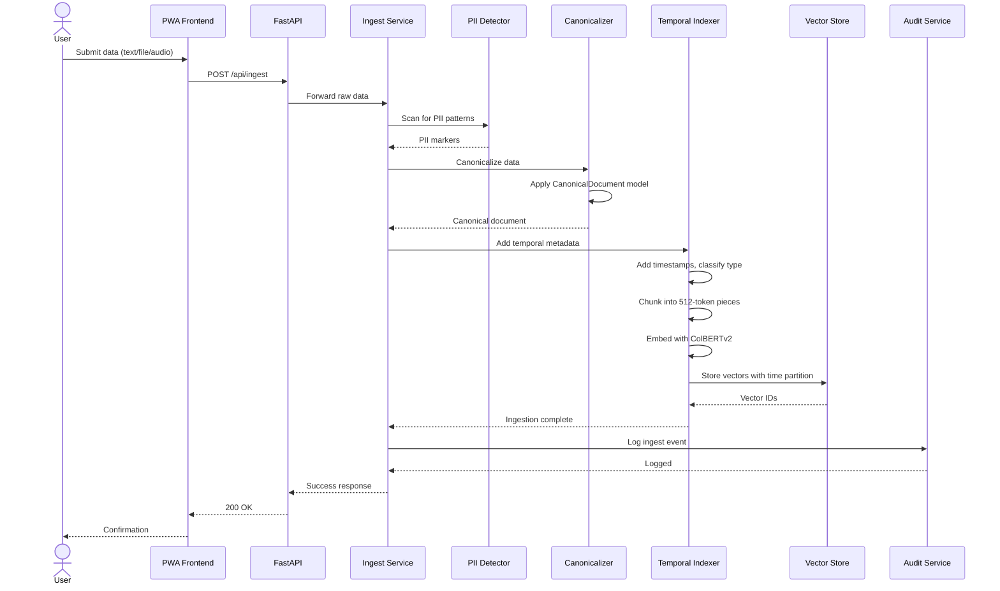
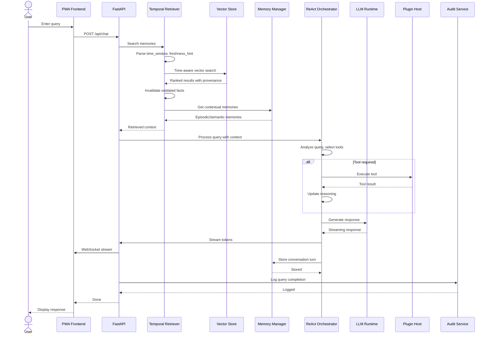
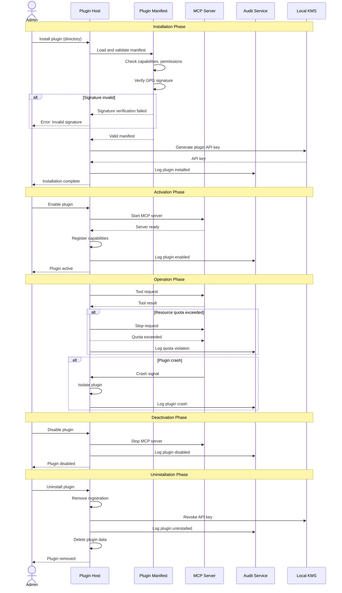
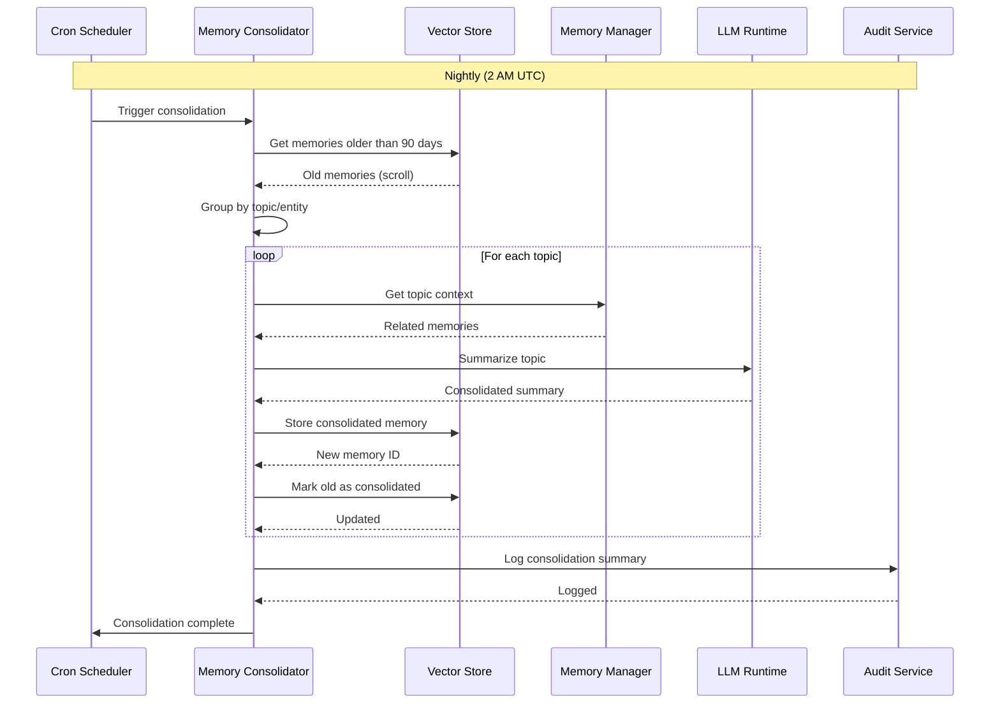
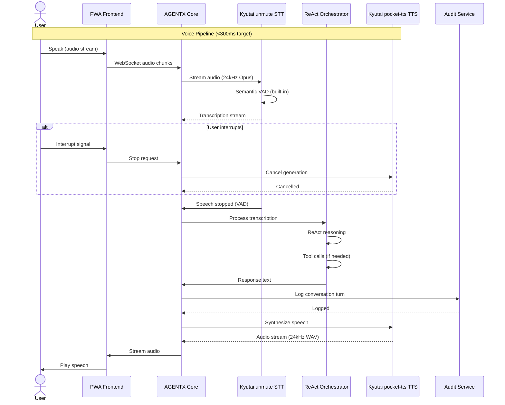

# AGENTX Sequence Diagrams

**Version**: 1.0.0
**Date**: 2026-01-19
**Status**: Draft
**Part of**: AGENTX HLD v1.0

---

## Table of Contents

1. [Ingest Flow](#1-ingest-flow)
2. [Query Flow](#2-query-flow)
3. [Plugin Lifecycle](#3-plugin-lifecycle)
4. [Memory Consolidation](#4-memory-consolidation)
5. [Voice Flow](#5-voice-flow)

---

## 1. Ingest Flow

### Overview

Data ingestion from plugins/API through canonicalization to vector storage.

### Sequence Diagram

### Key States

| State | Description | Transition |
|-------|-------------|------------|
| **Received** | Raw data received | → Validating |
| **Validating** | Schema validation, PII detection | → Canonicalizing / Rejected |
| **Canonicalizing** | Apply canonical model | → Tagging |
| **Tagging** | Add temporal metadata | → Chunking |
| **Chunking** | Split into chunks | → Embedding |
| **Embedding** | Generate embeddings | → Indexing |
| **Indexing** | Store in Qdrant | → Complete |
| **Rejected** | Validation failed | → Error response |

---

## 2. Query Flow

### Overview

User query with temporal-aware retrieval and fact invalidation.

### Sequence Diagram

### Query States

| State | Description | Timeout |
|-------|-------------|----------|
| **Receiving** | Accept query input | N/A |
| **Searching** | Temporal vector search | 500ms |
| **Invalidating** | Remove outdated facts | 100ms |
| **Reasoning** | DSPy ReAct planning | 2s (first token) |
| **Tool Execution** | Plugin tool calls | 30s per tool |
| **Generating** | LLM streaming response | 17s average (R013) |
| **Storing** | Save conversation turn | 100ms |

---

## 3. Plugin Lifecycle

### Overview

Plugin installation, activation, deactivation, and removal.

### Sequence Diagram

### Plugin States

| State | Description | Valid Transitions |
|-------|-------------|-------------------|
| **Installed** | Plugin files present, not active | → Activating, Uninstalling |
| **Activating** | Starting MCP server | → Active, Failed |
| **Active** | Server running, accepting requests | → Deactivating, Crashed |
| **Deactivating** | Stopping server | → Installed, Failed |
| **Crashed** | Server crashed, isolated | → Activating, Uninstalling |
| **Failed** | Operation failed | → Installed, Uninstalling |

---

## 4. Memory Consolidation

### Overview

Periodic consolidation of old memories into summarized form.

### Sequence Diagram

### Consolidation States

| State | Description | Transition |
|-------|-------------|------------|
| **Idle** | Waiting for schedule | → Scanning |
| **Scanning** | Finding old memories | → Grouping |
| **Grouping** | Grouping by topic | → Summarizing |
| **Summarizing** | LLM summarization | → Storing |
| **Storing** | Store consolidated | → Marking |
| **Marking** | Mark old as consolidated | → Complete |
| **Complete** | Ready for next run | → Idle |

---

## 5. Voice Flow

### Overview

Voice interaction pipeline (see kyutai_speech_integration_plan.md for full details).

### Sequence Diagram

### Voice States

| State | Description | Timeout |
|-------|-------------|----------|
| **Listening** | Waiting for speech start | N/A |
| **Streaming** | Receiving audio chunks | 30s max |
| **Processing** | STT + LLM + TTS pipeline | <300ms target |
| **Speaking** | Playing TTS audio | Interruptible |
| **Interrupted** | User stopped playback | N/A |

### Latency Budget

| Component | Target | Actual (Kyutai) |
|-----------|--------|-----------------|
| **VAD** | 50ms | Built-in semantic VAD |
| **STT (streaming)** | 100ms | 500ms (1B model) |
| **LLM (first token)** | 50ms | 1.36s (DSPy + Ollama) |
| **TTS (first chunk)** | 100ms | 200ms (pocket-tts) |
| **Network** | 0ms | Local containers |
| **Total** | **300ms** | ~2.2s (voice-only) |

---

## Appendix: Error Handling

### Common Error Scenarios

| Scenario | Detection | Response | Recovery |
|----------|-----------|----------|----------|
| **Invalid PII** | PII detector | Reject with reason | User resubmits |
| **Qdrant timeout** | 5s elapsed | In-memory fallback | Retry in background |
| **Plugin crash** | Process exit | Isolate plugin | Restart plugin |
| **LLM timeout** | 10s elapsed | Cached response | User retries |
| **Audio timeout** | 30s silence | End listening | Ready for next |

---

**This document is part of AGENTX HLD v1.0. See [HLD.md](HLD.md) for complete architecture.**
