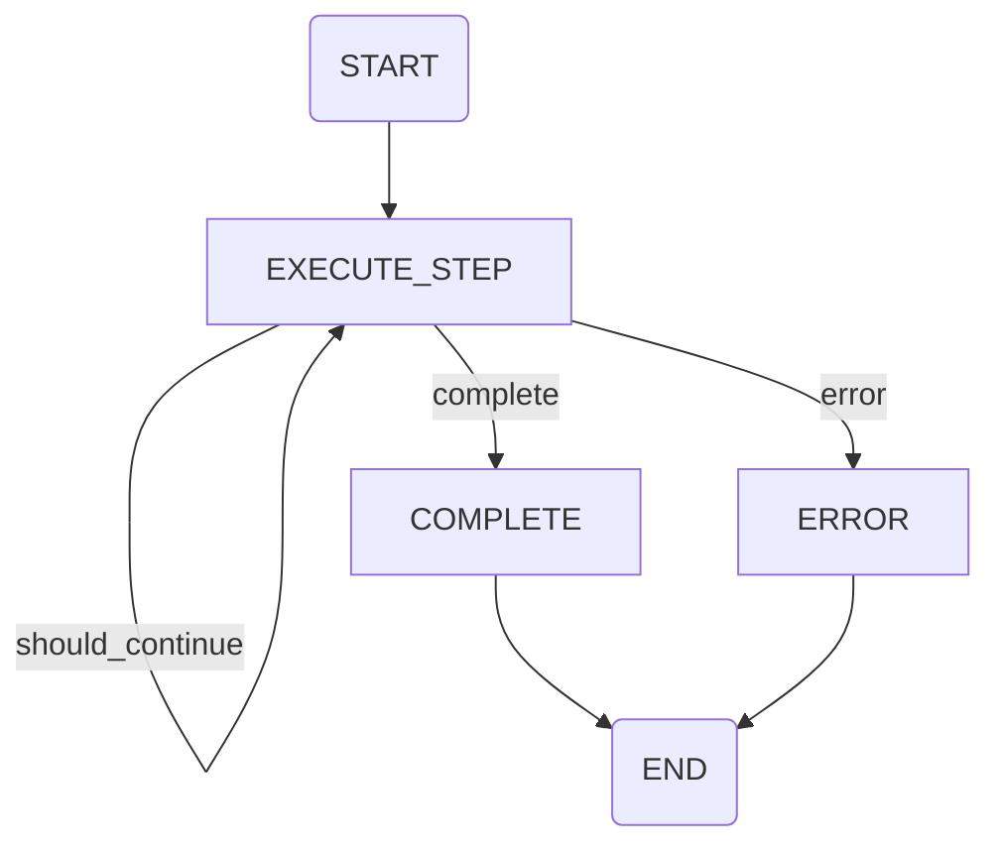

# Spec: langgraph-state-machines

**File**: `specs/langgraph-state-machines/spec.md`

**Generated**: 2026-01-28
**Change**: c003-agent-pipeline

---

## 1.1 Purpose

Define LangGraph state machines for backend agent reasoning flow and frontend UI component lifecycle. State machines provide declarative, visualizable control flow with built-in state management and error handling.

---

## 1.2 Scope

**In Scope**:
- BackendLangGraphState with agent reasoning flow nodes
- FrontendLangGraphState with UI lifecycle management nodes
- State transition logic with conditional edges
- Form interrupt/resume pattern
- Integration with DSPy agents as LangGraph nodes

**Out of Scope**:
- DSPy agent implementation (covered by dspy-* specs)
- UI descriptor rendering (frontend concern)
- WebSocket message delivery (covered by C002 data contracts)

---

## 1.3 Requirements

### Functional Requirements

| ID | Requirement | Priority |
|----|-------------|----------|
| FR-LG-001 | Backend state machine MUST transition through IDLE → THINKING → USING_TOOL → COMPLETED | Must |
| FR-LG-002 | Frontend state machine MUST support create, update, dismiss, form_submit, progress operations | Must |
| FR-LG-003 | State machines MUST use TypedDict for state schemas | Must |
| FR-LG-004 | Backend state MUST track reasoning_steps, tool_calls, confidence_score | Must |
| FR-LG-005 | Frontend state MUST track active_components, pending_forms, stream_queue | Must |
| FR-LG-006 | Form interrupt MUST pause agent execution until form submitted | Must |
| FR-LG-007 | State machines MUST be compilable with LangGraph compile() | Must |

### Non-Functional Requirements

| ID | Requirement | Priority |
|----|-------------|----------|
| NFR-LG-001 | State machine files MUST NOT exceed 150 lines each | Must |
| NFR-LG-002 | State machines MUST use absolute imports only | Must |
| NFR-LG-003 | State machines MUST pass ruff check and ruff format | Must |
| NFR-LG-004 | State transitions MUST complete within 100ms per node | Should |

---

## 1.4 Data Model

**Locked from LLD: agent_runtime.md:681-750**

```python
# File: agent/langgraph/backend_state_machine.py
from typing import TypedDict, List, Dict, Any, Literal
from uuid import UUID

from langgraph.graph import StateGraph, END
from domain.entities.enums import AgentStatus


class BackendLangGraphState(TypedDict):
    """Backend state for agent reasoning."""

    session_id: str
    user_query: str
    conversation_history: List[Dict[str, str]]
    retrieved_context: str
    reasoning_steps: List[Dict[str, Any]]
    current_step: int
    agent_status: AgentStatus
    confidence_score: float
    should_continue: bool
    error_message: str


def create_backend_state_machine() -> StateGraph:
    """Create LangGraph state machine for backend agent flow."""

    # Define state machine
    workflow = StateGraph(BackendLangGraphState)

    # Define nodes
    async def start_reasoning(state: BackendLangGraphState) -> BackendLangGraphState:
        """Start agent reasoning."""
        state["agent_status"] = AgentStatus.THINKING
        state["current_step"] = 0
        return state

    async def execute_step(state: BackendLangGraphState) -> BackendLangGraphState:
        """Execute single reasoning step."""
        state["current_step"] += 1
        # Agent execution logic here
        return state

    async def check_completion(state: BackendLangGraphState) -> BackendLangGraphState:
        """Check if reasoning is complete."""
        state["agent_status"] = AgentStatus.COMPLETED
        state["should_continue"] = False
        return state

    async def handle_error(state: BackendLangGraphState) -> BackendLangGraphState:
        """Handle agent error."""
        state["agent_status"] = AgentStatus.FAILED
        state["should_continue"] = False
        return state

    # Add nodes
    workflow.add_node("start", start_reasoning)
    workflow.add_node("execute_step", execute_step)
    workflow.add_node("complete", check_completion)
    workflow.add_node("error", handle_error)

    # Define edges
    workflow.add_edge("start", "execute_step")
    workflow.add_conditional_edges(
        "execute_step",
        lambda s: "complete" if s["should_continue"] else "continue",
        {
            "complete": "complete",
            "continue": "execute_step"
        }
    )
    workflow.add_edge("complete", END)
    workflow.add_edge("error", END)

    # Set entry point
    workflow.set_entry_point("start")

    return workflow.compile()
```

**Locked from LLD: agent_runtime.md:752-819**

```python
# File: agent/langgraph/frontend_state_machine.py
from typing import TypedDict, List, Dict, Any, Literal
from uuid import UUID

from langgraph.graph import StateGraph, END
from domain.entities.enums import VisibilityState, UIComponentType


class FrontendLangGraphState(TypedDict):
    """Frontend state for UI lifecycle management."""

    session_id: str
    active_components: Dict[str, Dict[str, Any]]
    visibility_state: VisibilityState
    focused_component_id: str
    pending_forms: Dict[str, Dict[str, Any]]
    stream_queue: List[Dict[str, Any]]
    form_interrupt: bool


def create_frontend_state_machine() -> StateGraph:
    """Create LangGraph state machine for frontend UI flow."""

    workflow = StateGraph(FrontendLangGraphState)

    async def create_component(state: FrontendLangGraphState) -> FrontendLangGraphState:
        """Create new UI component."""
        return state

    async def update_component(state: FrontendLangGraphState) -> FrontendLangGraphState:
        """Update existing UI component."""
        return state

    async def dismiss_component(state: FrontendLangGraphState) -> FrontendLangGraphState:
        """Dismiss UI component."""
        return state

    async def handle_form_submit(state: FrontendLangGraphState) -> FrontendLangGraphState:
        """Handle form submission."""
        state["form_interrupt"] = False
        return state

    async def show_progress(state: FrontendLangGraphState) -> FrontendLangGraphState:
        """Show progress indicator."""
        return state

    # Add nodes
    workflow.add_node("create", create_component)
    workflow.add_node("update", update_component)
    workflow.add_node("dismiss", dismiss_component)
    workflow.add_node("form_submit", handle_form_submit)
    workflow.add_node("progress", show_progress)

    # Define edges
    workflow.add_edge("create", END)
    workflow.add_edge("update", END)
    workflow.add_edge("dismiss", END)
    workflow.add_edge("form_submit", END)
    workflow.add_edge("progress", END)

    workflow.set_entry_point("create")

    return workflow.compile()
```

**Locked from LLD: domain_model.md:396-412**

```python
# File: domain/entities/enums.py
from enum import Enum


class AgentStatus(str, Enum):
    """Agent processing status."""

    IDLE = "idle"
    THINKING = "thinking"
    USING_TOOL = "using_tool"
    COMPLETED = "completed"
    FAILED = "failed"


class VisibilityState(str, Enum):
    """Chat UI visibility state."""

    CHAT_VISIBLE = "chat_visible"
    CHAT_MINIMIZED = "chat_minimized"
    CHAT_HIDDEN = "chat_hidden"
```

---

## 1.5 API Contract

### Backend State Machine Flow

```
┌─────────────────────────────────────────────────────────┐
│                  Backend State Machine                  │
├─────────────────────────────────────────────────────────┤
│                                                         │
│  ┌─────────┐    ┌──────────────┐    ┌─────────────┐   │
│  │  START  │───▶│ EXECUTE_STEP │───▶│  COMPLETE   │   │
│  └─────────┘    └──────┬───────┘    └──────┬──────┘   │
│                      │                     │          │
│                      │  (loop)             │          │
│                      └─────────────────────┘          │
│                      │                                 │
│                      ▼                                 │
│                ┌─────────┐                             │
│                │  ERROR  │                             │
│                └────┬────┘                             │
│                     │                                  │
│                     ▼                                  │
│                   ┌───┐                                │
│                   │END│                                │
│                   └───┘                                │
└─────────────────────────────────────────────────────────┘
```

**State Transition Table**:

| Current State | Event | Next State | Action |
|---------------|-------|------------|--------|
| IDLE | query_received | THINKING | Set agent_status=THINKING |
| THINKING | step_complete | USING_TOOL | Execute tool, increment step |
| USING_TOOL | tool_complete | THINKING | Check completion condition |
| THINKING | should_continue=False | COMPLETED | Set should_continue=False |
| USING_TOOL | error | FAILED | Set error_message |
| COMPLETED | - | END | Return final result |
| FAILED | - | END | Return error |

### Frontend State Machine Flow

```
┌─────────────────────────────────────────────────────────┐
│                 Frontend State Machine                  │
├─────────────────────────────────────────────────────────┤
│                                                         │
│                   ┌─────────┐                           │
│                   │ CREATE  │                           │
│                   └────┬────┘                           │
│                        │                                │
│         ┌──────────────┼──────────────┐                │
│         ▼              ▼              ▼                │
│  ┌─────────┐    ┌─────────┐    ┌─────────┐           │
│  │  UPDATE │    │ DISMISS │    │ PROGRESS │           │
│  └────┬────┘    └────┬────┘    └────┬────┘           │
│       │              │              │                   │
│       └──────────────┼──────────────┘                   │
│                      ▼                                  │
│              ┌───────────────┐                          │
│              │ FORM_SUBMIT   │ (with interrupt)          │
│              └───────┬───────┘                          │
│                      │                                  │
│                      ▼                                  │
│                    ┌───┐                                │
│                    │END│                                │
│                    └───┘                                │
└─────────────────────────────────────────────────────────┘
```

### Form Interrupt/Resume Pattern

```python
# Form interrupt (frontend state machine)
async def request_form_input(state: FrontendLangGraphState) -> FrontendLangGraphState:
    """Pause execution and request form input from user."""
    state["form_interrupt"] = True
    # Send FORM_SHOW message via WebSocket
    return state

# Form resume (backend state machine)
async def on_form_submit(
    state: BackendLangGraphState,
    form_data: Dict[str, Any]
) -> BackendLangGraphState:
    """Resume execution after form submission."""
    state["retrieved_context"] = str(form_data)
    state["should_continue"] = True
    return state
```

---

## 1.6 Business Rules

| Rule | Description | Enforcement |
|------|-------------|-------------|
| **BR-LG-001** | Max reasoning steps MUST NOT exceed 8 | Configuration in state machine |
| **BR-LG-002** | Form interrupt MUST pause agent execution | Node logic in frontend state machine |
| **BR-LG-003** | Closed sessions MUST NOT accept new queries | State validation on entry |
| **BR-LG-004** | Failed state MUST preserve error message | Error handling node |
| **BR-LG-005** | Component dismissal MUST be idempotent | Node logic in dismiss node |

---

## 1.7 Acceptance Criteria

- [ ] Backend state machine compiles without errors
- [ ] Frontend state machine compiles without errors
- [ ] Backend transitions through IDLE → THINKING → USING_TOOL → COMPLETED
- [ ] Frontend supports create, update, dismiss, form_submit, progress
- [ ] Form interrupt pauses execution correctly
- [ ] Form resume continues execution with form data
- [ ] State transitions logged for observability
- [ ] Files under 150 lines each
- [ ] Integration test with DSPy agents passes
- [ ] Error handling triggers FAILED state correctly

---

**Related Specs**:
- `specs/dspy-main-agent/spec.md` - Main DSPy agent (used as node)
- `specs/dspy-ui-agent/spec.md` - UI specialist (used as node)
- `specs/dspy-rag-agent/spec.md` - RAG specialist (used as node)
- C002 data contracts - WebSocket messages for state updates

---

**State Machine Visualization** (LangGraph Mermaid export):



---

**Integration with AgentOrchestrator**:

```python
# File: application/services/agent_orchestrator.py
from agent.langgraph.backend_state_machine import create_backend_state_machine
from agent.langgraph.frontend_state_machine import create_frontend_state_machine
from agent.dspy_agents.main_react_agent import MainDSPyReActAgent


class AgentOrchestrator:
    """Coordinates state machines and DSPy agents."""

    def __init__(self, main_agent: MainDSPyReActAgent):
        self._main_agent = main_agent
        self._backend_workflow = create_backend_state_machine()
        self._frontend_workflow = create_frontend_state_machine()

    async def execute_query(
        self,
        session_id: str,
        user_query: str,
        conversation_history: List[str]
    ) -> Dict[str, Any]:
        """Execute query through state machine."""

        initial_state = {
            "session_id": session_id,
            "user_query": user_query,
            "conversation_history": conversation_history,
            "retrieved_context": "",
            "reasoning_steps": [],
            "current_step": 0,
            "agent_status": AgentStatus.IDLE,
            "confidence_score": 0.0,
            "should_continue": True,
            "error_message": ""
        }

        final_state = await self._backend_workflow.ainvoke(initial_state)
        return final_state
```
